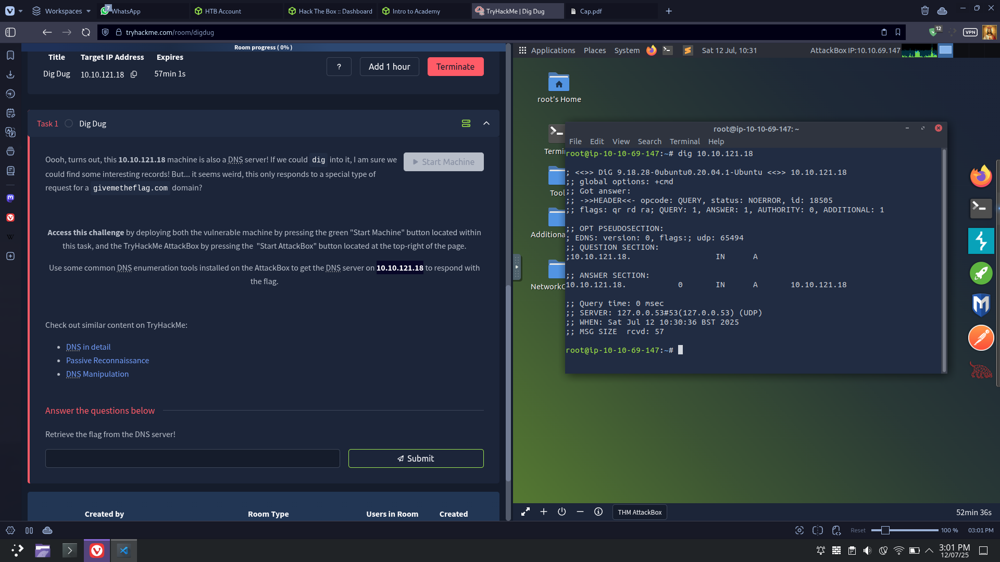
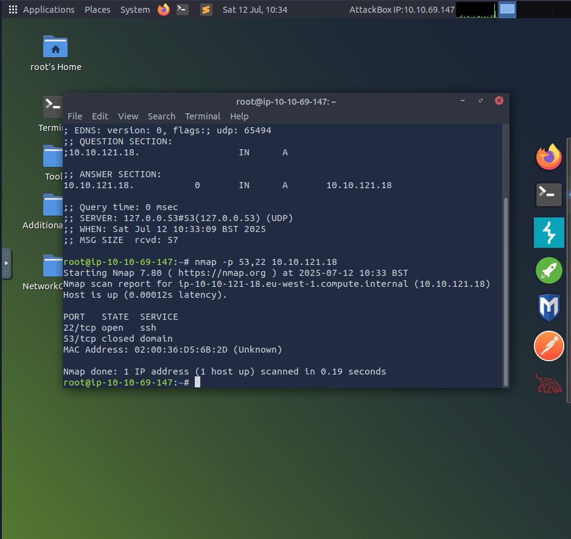
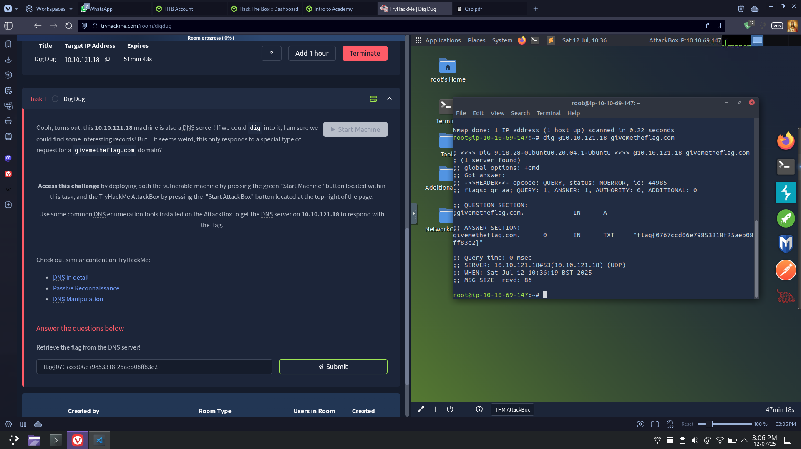
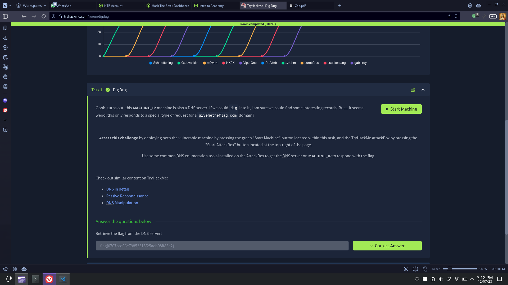

# 🌐 TryHackMe – Dig Dug Writeup

## 🔍 Challenge Overview

* **Room Name:** Dig Dug
* **Platform:** TryHackMe
* **Difficulty:** Very Easy (Intro to DNS)
* **Objective:** Query a DNS server to retrieve a hidden flag.
* **Room Link:** [https://tryhackme.com/room/digdug](https://tryhackme.com/room/digdug)

---

### 1. Deploy the Attack Box & Target Machine

Connect using OpenVPN or deploy the TryHackMe AttackBox and the Dig Dug machine. The target’s IP is denoted here as `<MACHINE_IP>` (10.10.121.18).

---



---

### 2. Recon – Identify DNS Service

Scan ports with Nmap:

```bash
nmap -p 53,22 <MACHINE_IP>
```

```bash
nmap -p 53,22 10.10.121.18
```

---



---

### 3. Understand the Goal

The room description mentions the server only responds to requests for the domain `givemetheflag.com`. This hints that querying this domain directly will reveal the flag.

---

### 4. Query the DNS Server


* **Using `dig`:**

  ```bash
  dig @<MACHINE_IP> givemetheflag.com
  ```

  ```bash
  dig @10.10.121.18 givemetheflag.com
  ```

  Response reveals:

  ```
  ;; ANSWER SECTION:
  givemetheflag.com.	0	IN	TXT	"flag{0767ccd06e79853318f25aeb08ff83e2}"
  ```

---



---

### 5. Capture & Submit the Flag

Copy the string enclosed in quotes from the TXT record (format: `flag{…}`) and submit it. That’s game over!

Flag : `flag{0767ccd06e79853318f25aeb08ff83e2}`

---



---

## 🔚 Conclusion

Dig Dug is a great introduction to DNS enumeration. With just one command, you can query a custom domain on a DNS server and extract information hidden in TXT records. It’s an essential skill in web and red-team operations.
